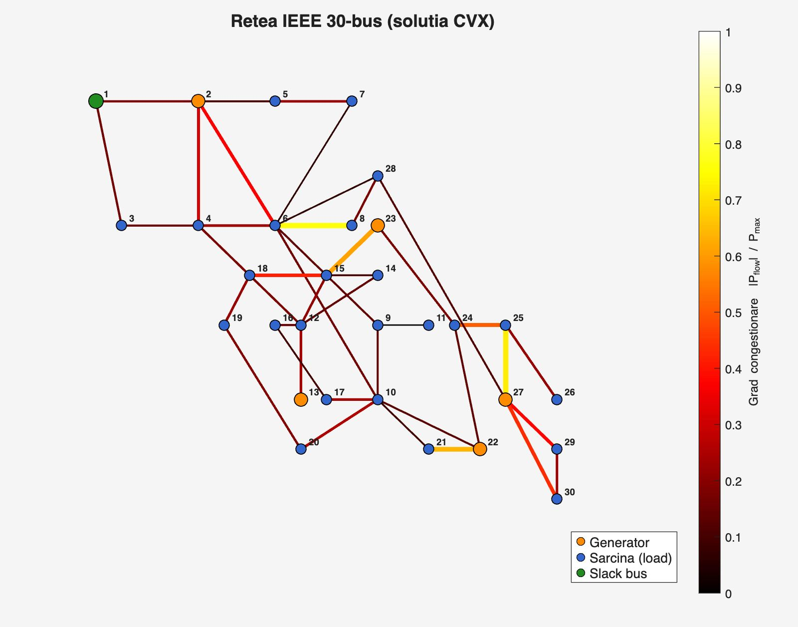
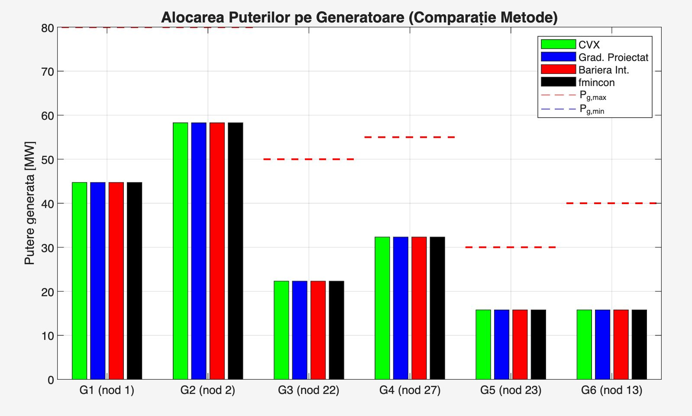
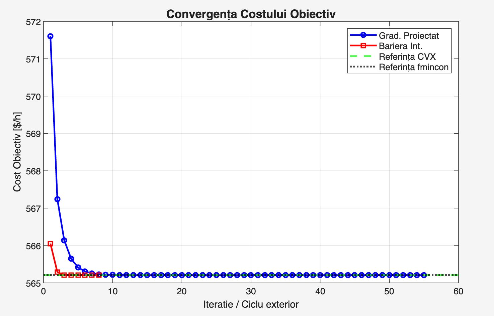
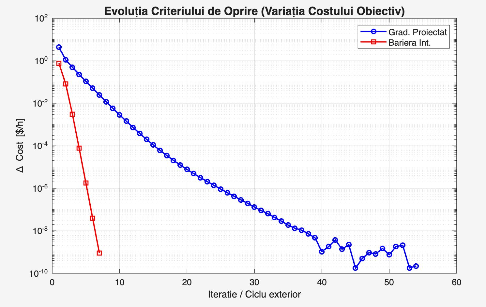

# ⚡ Optimal Power Flow (DC-OPF) using Convex Optimization

> [!IMPORTANT]
> **Core Problem Solving:** Electric power grids must dynamically distribute generation to minimize costs while strictly respecting complex physical laws (Kirchhoff's laws) and thermal limits. This project implements and benchmarks advanced optimization algorithms from scratch to solve the **Direct Current Optimal Power Flow (DC-OPF)** problem on an IEEE 30-bus grid system.

---

## 📐 Mathematical Modeling

The DC-OPF problem is mathematically formulated as a constrained **Quadratic Programming (QP)** problem. Because the cost functions are strictly convex ($c_{2i} > 0$), a unique global optimum is mathematically guaranteed.

### 1. Objective Function (Minimize Grid Generation Cost)
We minimize the total cost of active power generation across all $n_g = 6$ generators in the network:

$$\min_{\mathbf{P}_g, \boldsymbol{\theta}} \sum_{i=1}^{n_g} \left( c_{2i} P_{g_i}^2 + c_{1i} P_{g_i} + c_{0i} \right)$$

Where $c_{2i}, c_{1i}, c_{0i}$ represent the custom quadratic cost coefficients for each generator.

### 2. Operational & Physical Constraints
The system optimization is strictly bounded by the physics of the grid:

* **Nodal Power Balance (Kirchhoff's Current Law):**

$$B \boldsymbol{\theta} = C_g \mathbf{P}_g - \mathbf{P}_d$$

* **Transmission Lines Thermal Limits:**

$$-\mathbf{P}_{\max} \leq B_f \boldsymbol{\theta} \leq \mathbf{P}_{\max}$$

* **Generators Operational Bounds:**

$$\mathbf{P}_{g,\min} \leq \mathbf{P}_g \leq \mathbf{P}_{g,\max}$$

* **Reference (Slack) Bus Angle:** $\theta_{\text{slack}} = 0$

---

## 🛠️ Dimensionality Reduction & Engineering Decisions

> [!TIP]
> **Performance Optimization:** Inverting large matrices at every iteration is computationally expensive and numerically unstable. To solve this, **LU Factorization** was applied to the nodal susceptance matrix ($B$) *only once* at startup.

By algebraically eliminating the phase angles ($\boldsymbol{\theta}$) from the constraint equations, the problem was reduced to a smaller, high-speed space using precomputed matrices $M$ and $\mathbf{d}_f$:

$$M = B_f^{\text{red}} B_{\text{red}}^{-1} C_g^{\text{red}} \in \mathbb{R}^{41 \times 6}, \qquad \mathbf{d}_f = B_f^{\text{red}} B_{\text{red}}^{-1} \mathbf{P}_{d,\text{red}} \in \mathbb{R}^{41}$$

This optimization allows the active power flow on transmission lines ($\mathbf{P}_f$) to be computed instantly at each step:

$$\mathbf{P}_f = M \mathbf{P}_g - \mathbf{d}_f \in \mathbb{R}^{41}$$

---

## 🚀 Algorithms Implemented From Scratch

To understand algorithm mechanics beyond commercial black-box wrappers, two distinct mathematical approaches were engineered:

### 🔹 1. Projected Gradient Method (`grad_proiectat.m`)

* **How it works:** Computes the steepest descent direction via the objective gradient:

$$\nabla f(\mathbf{P}_g) = 2 \mathbf{c}_2 \odot \mathbf{P}_g + \mathbf{c}_1$$

* Takes an optimal Lipschitz step ($\alpha = 1/L$) and applies an **affine-box projection** via bisection to force the temporary step back into the feasible polytope.
* **Performance:** Linear convergence $\mathcal{O}(1/k)$. Required **55 iterations** to reach the global minimum.

### 🔹 2. Interior Point / Logarithmic Barrier Method (`met_barierei.m`)

* **How it works:** Replaces rigid inequality constraints with smooth logarithmic penalty barriers that repel the solution away from the physical grid boundaries:

$$\mathcal{B}_{\mu}(\mathbf{P}_g) = \sum_{i} \left(c_{2i}P_{g_i}^2 + c_{1i}P_{g_i}\right) - \mu \sum_{i} \left[ \ln(P_{g_i} - P_{g_i,\min}) + \ln(P_{g_i,\max} - P_{g_i}) \right] - \mu \sum_{k} \left[ \ln(P_{\max_k} - P_{f_k}) + \ln(P_{\max_k} + P_{f_k}) \right]$$

* Minimization is performed sequentially by decreasing $\mu$ using **Newton's Second-Order Method**, solving the classic KKT system at each step using Hessian matrix data:

$$\begin{bmatrix} H_{\mu} & \mathbf{e} \\ \mathbf{e}^{\top} & 0 \end{bmatrix} \begin{bmatrix} \Delta \mathbf{P}_g \\ \Delta \nu \end{bmatrix} = \begin{bmatrix} -\mathbf{r}_{\text{stat}} \\ -\mathbf{r}_{\text{feas}} \end{bmatrix}$$

* **Performance:** Super-linear/Quadratic convergence. Reached the exact optimum in just **8 outer cycles**.

---

## 📊 Benchmarking & Quality Metrics

Validation was conducted by calculating the **Nodal Feasibility Error ($\varepsilon_{\text{feas}}$)** and verifying optimal allocation against the commercial solver **CVX** ($R^2$ score).

$$\varepsilon_{\text{feas}} = \lVert C_g \mathbf{P}_g - B \boldsymbol{\theta} - \mathbf{P}_d \rVert_2$$

| Optimization Method | Total Grid Cost ($/h) | Feasibility Error (Kirchhoff) | $R^2$ vs. CVX | Iterations / Cycles |
| :--- | :---: | :---: | :---: | :---: |
| 🟢 **Interior Barrier (Custom)** | **565.21** | **1.80e-15** | **1.0000** | **8** |
| 🔵 Projected Gradient (Custom) | 565.21 | 1.18e-12 | 1.0000 | 55 |
| ⚫ fmincon (MATLAB Benchmark) | 565.21 | 1.64e-15 | 1.0000 | 14 |
| 🏆 CVX (Theoretical Gold Standard) | 565.21 | 5.16e-12 | 1.0000 | N/A |

### 📈 Convergence & Results Showcase

| Nodal Congestion Map | Active Power Allocation |
|---|---|
|  |  |

| Objective Cost Convergence | Stopping Criterion Evolution ($\Delta \text{Cost}$) |
|---|---|
|  |  |

> [!NOTE]
> **Key Analytical Takeaway:** While both custom methods successfully converge to the exact same global minimum, the **Interior Barrier Method is $7\times$ faster** in terms of iteration count. This visually proves the massive advantage of leveraging second-order geometric information (Hessian matrix) over pure gradient descent in grid-scale data analytics.
